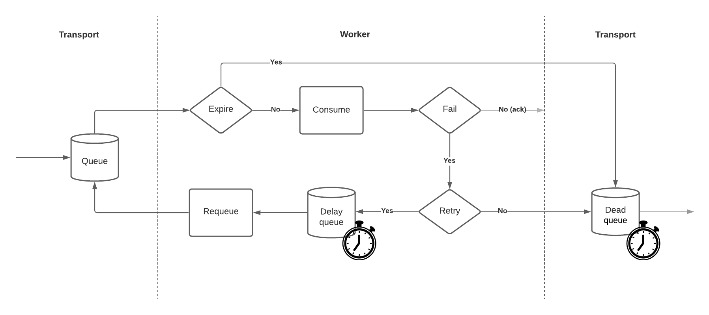

.. _lifecycle:

Message lifecycle
=================
.. warning::

    Expiration, retrying and 'dead letters' queueing supported in ``RabbitMQTransport`` only (**on** by default).

`django-cqrs` since version 1.11 provides mechanism for reliable message delivery.

Expiration
----------
+------------------+------------+---------------------------------------------------------------------------------------------+
| Name             | Default    | Description                                                                                 |
+==================+============+=============================================================================================+
| CQRS_MESSAGE_TTL | 86400      | Limits message lifetime in **seconds**, then it will be moved to 'dead letters' queue.      |
+------------------+------------+---------------------------------------------------------------------------------------------+

.. code-block:: python

    # settings.py

    CQRS = {
        ...
        'master': {
            'CQRS_MESSAGE_TTL': 86400, # 1 day
        },
    }

Fail
----
Message assumed as failed when a consumer raises an exception or returns negative boolean value (*False*, *None*, etc).

.. code-block:: python

    # models.py

    class Example(ReplicaMixin, models.Model):
        CQRS_ID = 'example'
        ...

        @classmethod
        def cqrs_create(cls, sync, mapped_data, previous_data=None):
            raise Exception("Some issue during create") # exception could be caught at should_retry_cqrs() method

        def cqrs_update(self, sync, mapped_data, previous_data=None):
            return None # returning negative boolean for retrying

Retrying
--------
+----------------------+----------+-----------------------------------------------------------------------------+
| Name                 | Default  | Description                                                                 |
+======================+==========+=============================================================================+
| CQRS_MAX_RETRIES     | 30       | Maximum number of retry attempts. Infinite if *None*, 0 to disable retries. |
+----------------------+----------+-----------------------------------------------------------------------------+
| CQRS_RETRY_DELAY     | 2        | Constant delay in **seconds** between message failure and requeueing.       |
+----------------------+----------+-----------------------------------------------------------------------------+
| delay_queue_max_size | 1000     | Maximum number of delayed messages per worker. Infinite if *None*.          |
+----------------------+----------+-----------------------------------------------------------------------------+

.. code-block:: python

    # settings.py

    CQRS = {
        ...
        'replica': {
            'CQRS_MAX_RETRIES': 30, # attempts
            'CQRS_RETRY_DELAY': 2,  # seconds
            'delay_queue_max_size': 1000,
        },
    }

Customization
^^^^^^^^^^^^^
The :class:`dj_cqrs.mixins.ReplicaMixin` allows to take full control on retrying.

.. code-block:: python

    # models.py

    class Example(ReplicaMixin, models.Model):
        CQRS_ID = 'example'
        ...

        @classmethod
        def get_cqrs_retry_delay(cls, current_retry=0):
            # Linear delay growth
            return (current_retry + 1) * 60

        @classmethod
        def should_retry_cqrs(cls, current_retry, exception=None):
            # Retry 10 times or until we have troubles with database
            return (
                current_retry < 10
                or isinstance(exception, django.db.OperationalError)
            )

Dead letters
------------
Expired or failed messages which should not be retried are moved to 'dead letters' queue.

+-------------------+-------------------------+----------------------------------------------------+
| Name              | Default                 | Description                                        |
+===================+=========================+====================================================+
| dead_letter_queue | 'dead_letter\_' + queue | Queue name for dead letters.                       |
+-------------------+-------------------------+----------------------------------------------------+
| dead_message_ttl  | 864000                  | Expiration **seconds**. Infinite if *None*.        |
+-------------------+-------------------------+----------------------------------------------------+

.. code-block:: python

    # settings.py

    CQRS = {
        ...
        'queue': 'example',
        'replica': {
            ...
            'dead_letter_queue': 'dead_letter_example', # generated from CQRS.queue
            'dead_message_ttl': 864000, # 10 days
        },
    }

Commands
^^^^^^^^
Dump
""""""""""""
Dumps all dead letters to stdout.

.. code-block:: console

    $ python manage.py cqrs_dead_letters dump
    {"signal_type":"SAVE","cqrs_id":"example","instance_data":{"id":1,"cqrs_revision":0,"cqrs_updated":"2021-04-30 11:50:05.164341+00:00"},"previous_data":null,"instance_pk":135,"correlation_id":null,"retries":30,"expires":"2021-05-01T11:50:00+00:00"}

Retry
"""""""""""""
Retry all dead letters.
Message body retries and expires fields are downgraded.

.. code-block:: console

    $ python manage.py cqrs_dead_letters retry
    Total dead letters: 1
    Retrying: 1/1
    {"signal_type":"SAVE","cqrs_id":"example","instance_data":{"id":1,"cqrs_revision":0,"cqrs_updated":"2021-04-30 11:50:05.164341+00:00"},"previous_data":null,"instance_pk":135,"correlation_id":null,"retries":0,"expires":"2021-05-02T12:30:00+00:00"}

Purge
"""""""""""""
Removes all dead letters.

.. code-block:: console

    $ python manage.py cqrs_dead_letters purge
    Total dead letters: 1
    Purged
